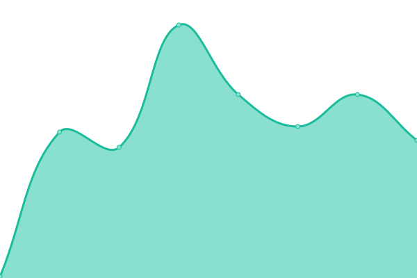
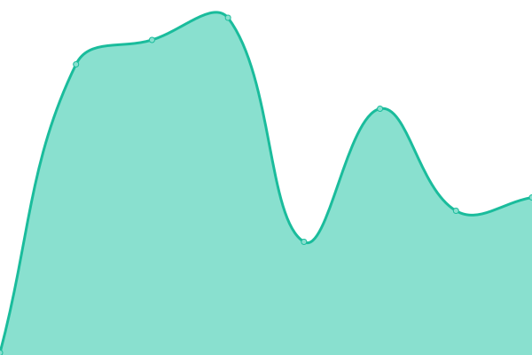

# [📈 Live Status](https://uptime.anlayana.com): <!--live status--> **🟥 Complete outage**

This repository contains the open-source uptime monitor and status page for [æm](https://localhost:2609), powered by [Upptime](https://github.com/upptime/upptime).

With [Upptime](https://upptime.js.org), you can get your own unlimited and free uptime monitor and status page, powered entirely by a GitHub repository. We use [Issues](https://github.com/Mid0aria/anlayana-uptime/issues) as incident reports, [Actions](https://github.com/Mid0aria/anlayana-uptime/actions) as uptime monitors, and [Pages](https://uptime.anlayana.com) for the status page.

<!--start: status pages-->
<!-- This summary is generated by Upptime (https://github.com/upptime/upptime) -->
<!-- Do not edit this manually, your changes will be overwritten -->
<!-- prettier-ignore -->
| URL | Status | History | Response Time | Uptime |
| --- | ------ | ------- | ------------- | ------ |
|  [Anlayana](https://anlayana.com) | 🟥 Down | [anlayana.yml](https://github.com/Mid0aria/anlayana-uptime/commits/HEAD/history/anlayana.yml) | 

 95ms
     
 | 

<a href="https://uptime.anlayana.com/history/anlayana">0.00%</a>
    

|  [Mido](https://mido.anlayana.com) | 🟥 Down | [mido.yml](https://github.com/Mid0aria/anlayana-uptime/commits/HEAD/history/mido.yml) | 

 85ms
     
 | 

<a href="https://uptime.anlayana.com/history/mido">0.00%</a>
    

|  [Syan](https://syan.anlayana.com) | 🟥 Down | [syan.yml](https://github.com/Mid0aria/anlayana-uptime/commits/HEAD/history/syan.yml) | 

 99ms
     
 | 

<a href="https://uptime.anlayana.com/history/syan">0.00%</a>
    

|  [Cards](https://cards.anlayana.com) | 🟥 Down | [cards.yml](https://github.com/Mid0aria/anlayana-uptime/commits/HEAD/history/cards.yml) | 

 69ms
     
 | 

<a href="https://uptime.anlayana.com/history/cards">0.00%</a>
    

<!--end: status pages-->

[**Visit our status website →**](https://uptime.anlayana.com)

## 📄 License

- Powered by: [Upptime](https://github.com/upptime/upptime)
- Code: [MIT](./LICENSE) © [Anand Chowdhary](https://anandchowdhary.com), supported by [Pabio](https://pabio.com)
- Data in the `./history` directory: [Open Database License](https://opendatacommons.org/licenses/odbl/1-0/)
